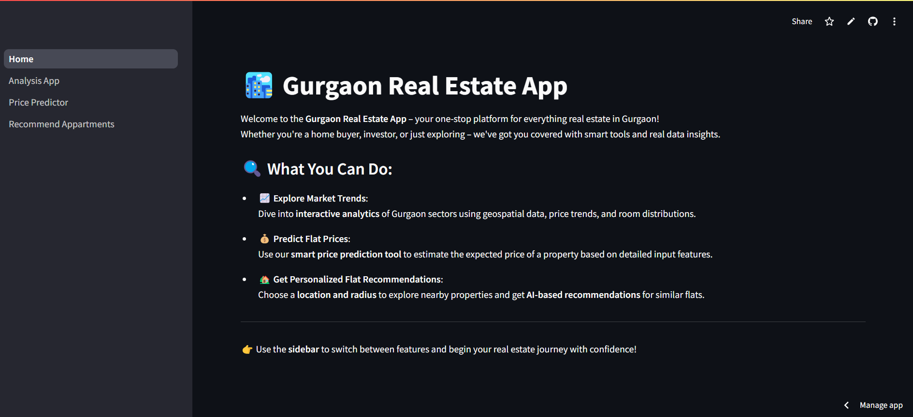
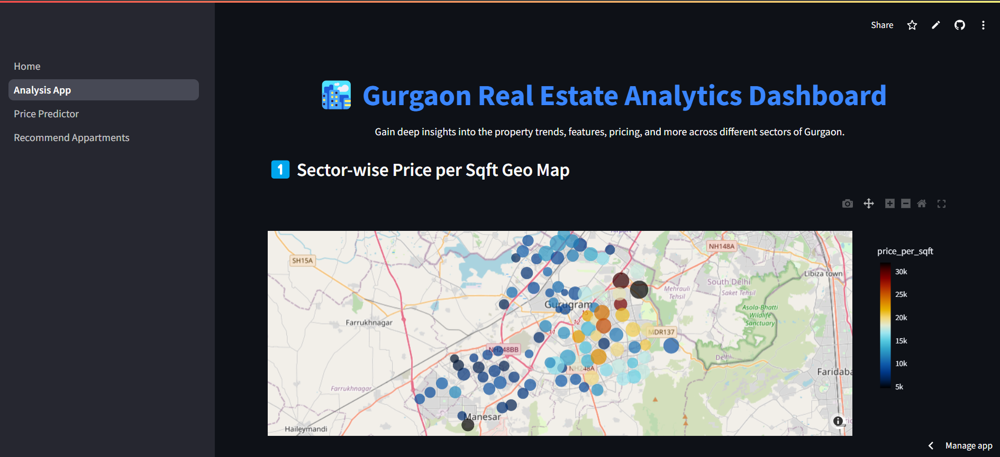
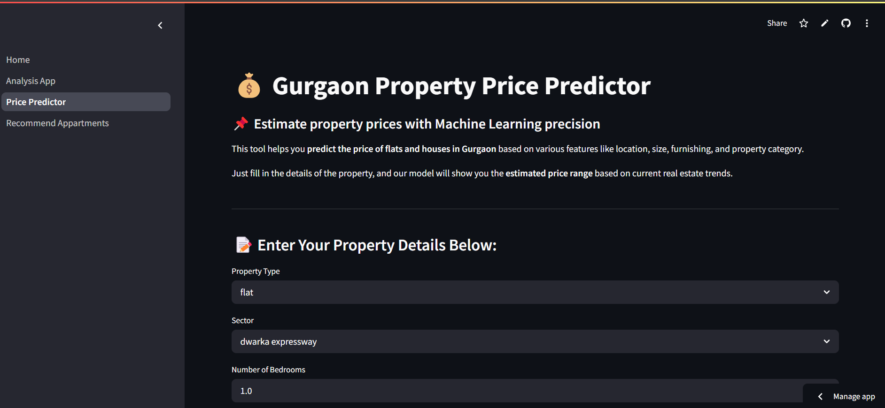
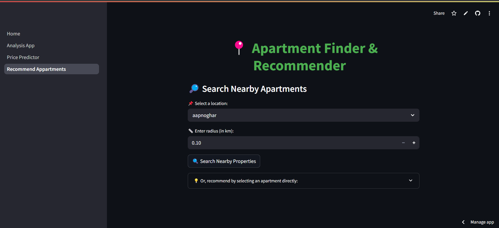

# 🏙️ Gurgaon Real Estate Project

Welcome to the **Gurgaon Real Estate Capstone Project**, an end-to-end Data Science and Machine Learning project designed to analyze, predict, and recommend real estate properties in Gurgaon. This project is divided into two repositories:

- 🔧 [Model Building & Data Cleaning](https://github.com/rajnish80130/Real-state-Capstone-Project)
- 💻 [Streamlit App Code](https://github.com/rajnish80130/Real-state-Capstone-Project-streamlit-code)

🔗 **Live Demo**: [Gurgaon Real Estate App](https://gurgaon-real-estate-project.streamlit.app/)

---

## 📌 Project Overview

This project aims to:

- Understand trends in Gurgaon real estate using data visualization.
- Build a machine learning model to predict apartment prices.
- Recommend similar apartments based on user selection.
- Deploy the entire solution using Streamlit.

---

## 🔍 Features

### 1. Home Page
- Introduction to the project and navigation links.
- A brief overview of app capabilities.

📸 **Screenshot Placeholder: Home Page**


---

### 2. Analysis App
- Interactive EDA dashboard.
- Insights on price distribution, BHK count, location-based pricing, etc.

📸 **Screenshot Placeholder: Analysis App**


---

### 3. Price Predictor
- Predicts apartment price based on input features like location, BHK, bathroom, and size.
- Uses Random Forest Regressor.

📸 **Screenshot Placeholder: Price Predictor**


---

### 4. Recommend Apartments
- Recommends 5 similar apartments based on cosine similarity.
- Select a location and get smart recommendations.

📸 **Screenshot Placeholder: Recommend Apartments**


---

## 🛠️ Tech Stack

- **Languages**: Python, Pandas, Numpy
- **Visualization**: Matplotlib, Seaborn, Plotly
- **Machine Learning**: Scikit-learn, Random Forest
- **Web App**: Streamlit
- **Deployment**: Streamlit Cloud
- **Recommendation System**: Cosine Similarity

---

## 📂 Repository Structure

### [`Real-state-Capstone-Project`](https://github.com/rajnish80130/Real-state-Capstone-Project)
```
├── Data Cleaning & Preprocessing
├── EDA Notebooks
├── Model Building
├── Feature Engineering
├── Model Evaluation
└── Final Model (model.pkl)
```

### [`Real-state-Capstone-Project-streamlit-code`](https://github.com/rajnish80130/Real-state-Capstone-Project-streamlit-code)
```
├── Home.py
├── model.pkl
├── cosine_sim1.pkl, cosine_sim2.pkl, cosine_sim3.pkl
├── data files (locations, flat data)
└── images (optional for screenshots)
```

---

## 🚀 How to Run Locally

1. Clone the repositories.
2. Install dependencies:
   ```
   pip install -r requirements.txt
   ```
3. Run the app:
   ```
   streamlit run Home.py
   ```

---

## 📈 Future Improvements

- Add filters for amenities, builder reputation, etc.
- Integrate with real-time APIs for live listings.
- Add map-based visualizations.

---

## 🤝 Contribution

Feel free to fork this repo and contribute via pull requests. Any suggestions or improvements are always welcome!

---

## 📬 Contact

**Author**: Rajnish  
🔗 GitHub: [rajnish80130](https://github.com/rajnish80130)  
🌐 Deployed App: [gurgaon-real-estate-project.streamlit.app](https://gurgaon-real-estate-project.streamlit.app/)

---
---

⭐ **If you found this project useful, don't forget to give it a star!**
